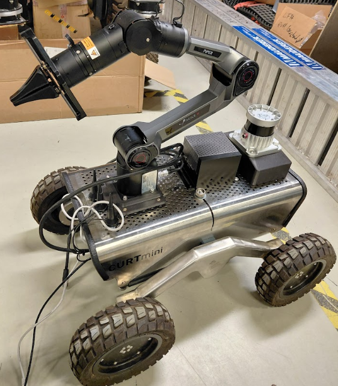

# Curt Mini with Piper Arm

<p align="center">
  
</p>

This repository contains five ROS 2 packages:

- `curtmini_piper_description`: the existing Curt Mini model combined with a
  Piper arm whose links and joints use the `piper_` prefix.
- `curtmini_piper_moveit_config`: shared SRDF, kinematics, joint limits,
  planning, perception, and RViz configuration.
- `curtmini_piper_bringup`: Curt Mini hardware bringup, AGX Piper control,
  MoveIt runtime, and RViz.
- `curtmini_piper_gz_sim`: Gazebo Harmonic simulation, simulated controllers,
  sensor bridges, MoveIt runtime, and RViz.
- `curtmini_piper_motion_examples`: controller-independent MoveItPy planning
  and execution examples for simulation and hardware.

The prefix-aware Piper model and meshes come from `agx_arm_urdf`; the Curt Mini
model lives in `curt_mini_description`, and base controllers remain in
`curt_mini_bringup`. This package owns only the mount and TCP joints that
connect the two models.

## Workspace setup

The following instructions assume ROS 2 Jazzy and a workspace at `~/new_ws`.

Install the workspace tools and system dependencies:

```bash
source /opt/ros/jazzy/setup.bash

sudo apt update
sudo apt install -y \
  python3-colcon-common-extensions \
  python3-vcstool \
  python3-rosdep \
  python3-can \
  python3-scipy \
  can-utils \
  ethtool
```

The Python dependency installation below requires
[`uv`](https://docs.astral.sh/uv/) to be available on `PATH`.

Initialize rosdep once per machine, if it has not already been initialized:

```bash
sudo rosdep init
```

An `already initialized` message can be ignored. Update the rosdep database:

```bash
rosdep update
```

Add dependency repos:
```sh
vcs import src \
  < src/curtmini_piper/dependencies.repos
```

Import the source dependencies pinned by the Curt Mini packages. The
`--skip-existing` option makes these commands safe to repeat without replacing
existing checkouts:

```sh
vcs import --recursive --skip-existing src \
  < src/curt_mini/ipa_ros2_control/ipa_ros2_control.repos
vcs import --recursive --skip-existing src \
  < src/curt_mini/curt_mini_bringup/curt_mini.repos
```

These manifests provide:

- The `agx_arm_ros` and `agx_arm_urdf` forks used by this integration.
- `candle_ros2` v2.1.2, required by the Curt Mini hardware interface.
- `openzen_driver`, required by the Curt Mini IMU launch.

Install the Python SDK used by the Piper hardware node:

Create a virtual environment
```sh
uv venv .venv
source .venv/bin/activate
```

Install pyAxArm python requirements
```bash
uv pip install --break-system-packages \
  "git+https://github.com/agilexrobotics/pyAgxArm.git"
```

```sh
uv pip install numpy pyyaml
```

Install the remaining declared ROS and system dependencies:

From the workspace:
```bash
rosdep install --from-paths src --ignore-src --rosdistro jazzy -ry
```

## Build

From the workspace root:

```bash
source /opt/ros/jazzy/setup.bash
colcon build --packages-up-to \
  curtmini_piper_bringup \
  curtmini_piper_gz_sim \
  curtmini_piper_motion_examples
source install/setup.bash
```

## Simulation

See github repo : [curtmini piper gz sim](https://github.com/ipa-may/curtmini_piper_gz_sim)


## Real robot

Activate the CAN bus. From the workspace:
```sh
bash src/piper_driver/agx_arm_ros/scripts/can_activate.sh
```

Piper + Mobile Base bringup
```bash
ros2 launch curtmini_piper_bringup bringup.launch.py
```

Piper only 
```sh
ros2 launch curtmini_piper_bringup bringup.launch.py start_base:=false
```

The defaults start the Curt Mini hardware, joystick, IMU, Piper on `can0`,
MoveIt, and RViz. MoveIt uses prefixed names such as `piper_joint1`; a bridge
translates these to the unprefixed names expected by `agx_arm_ctrl`.

The AGX command interface starts gated off and is opened only while the
trajectory action is active.

MoveIt uses the original Curt Mini visual mesh and a simplified box collision
for the chassis. The upstream 30 MB chassis STL remains in the full
robot-state-publisher description, but is not used as an FCL collision mesh.

## Hardware-free MoveIt/RViz

```bash
ros2 launch curtmini_piper_bringup bringup.launch.py \
  start_base:=false start_arm_hardware:=false
```

## Standalone MoveIt RViz

Start simulation or hardware bringup with `use_rviz:=false`, then run RViz as
a separate process:

```bash
# Simulation
ros2 launch curtmini_piper_moveit_config moveit_rviz.launch.py \
  use_sim_time:=true

# Real robot
ros2 launch curtmini_piper_moveit_config moveit_rviz.launch.py \
  use_sim_time:=false
```

This launch starts only RViz and expects the active bringup to provide
`move_group`, `/joint_states`, transforms, and the planning scene. Mount and
TCP offset arguments must match those passed to the bringup launch.

## MoveItPy

Start the simulation or real robot bringup first. Planning is non-executing by
default:

```bash
ros2 run curtmini_piper_motion_examples moveit_goal
```

Plan and execute in simulation:

```bash
ros2 run curtmini_piper_motion_examples moveit_goal --ros-args \
  -p controller_mode:=simulation \
  -p use_sim_time:=true \
  -p plan_only:=false
```

For physical hardware, set `controller_mode:=hardware` and leave
`use_sim_time:=false`. See the package README for joint and pose parameters.

## Mount calibration

The arm mount, TCP offset, and lidar mount are defined in
`curtmini_piper_description/config/geometry.yaml`. The arm and lidar mounts
are relative to `chassis`; the TCP offset is relative to `piper_link6`.
Update the YAML and restart bringup and planning clients together so their
robot descriptions use the same geometry.

## Dependency troubleshooting

The setuptools deprecation messages printed before the build starts are
warnings. The fatal error in the example above is CMake being unable to find
`candle_ros2`.

If CMake cannot find `candle_ros2`, confirm that the source import succeeded:

```bash
cd ~/piper_tests2
colcon list | grep -E '^(candle_ros2|openzen_driver)[[:space:]]'
```

Both packages should be listed. If either is missing, repeat the corresponding
`vcs import` command from the workspace setup section.

Before starting real Piper hardware, verify that its Python SDK is importable:

```bash
python3 -c "import pyAgxArm; print(pyAgxArm.__file__)"
```

The current MoveIt installation also reports a missing
`libgeometric_shapes.so.2.3.4` when loading its optional point-cloud octomap
updater. Arm planning and trajectory control still start successfully, but
depth-camera octomap updates require that system library mismatch to be fixed.
